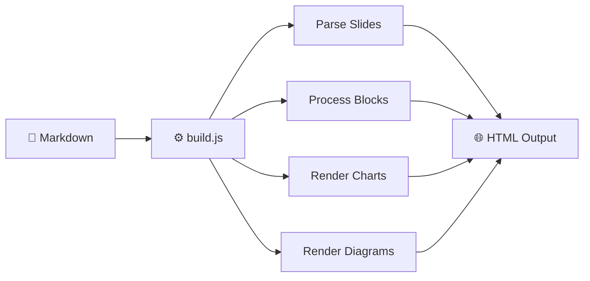

# Building a Presentation Pipeline with AI

How a Claude Code Skill Turns Markdown into Standalone HTML Decks

<p class="thesis"><strong>Core Thesis:</strong> The best tools don't just save time — they change what's possible. A Node.js pipeline turns markdown into production presentations in under 30 seconds.</p>
<p class="meta">February 2026</p>

<style>
/* ── Flow Diagram ── */
.flow-diagram {
  display: flex;
  align-items: center;
  justify-content: center;
  gap: 0;
  margin: 2rem 0;
  flex-wrap: wrap;
}
.flow-node {
  background: rgba(30, 33, 50, 0.8);
  border: 1px solid rgba(255, 255, 255, 0.1);
  border-radius: 12px;
  padding: 1rem 1.5rem;
  text-align: center;
  min-width: 140px;
}
.flow-node .flow-icon {
  font-size: 1.5rem;
  margin-bottom: 0.35rem;
}
.flow-node .flow-label {
  font-weight: 600;
  font-size: 0.95rem;
  color: #f0f2f8;
}
.flow-node .flow-sublabel {
  font-size: 0.75rem;
  color: #9a9ab0;
  margin-top: 0.15rem;
}
.flow-node.gold { border-color: rgba(212, 160, 74, 0.4); }
.flow-node.gold .flow-label { color: #e8b860; }
.flow-arrow {
  font-size: 1.5rem;
  color: rgba(212, 160, 74, 0.5);
  padding: 0 0.5rem;
}

/* ── Tech Grid ── */
.tech-grid {
  display: grid;
  grid-template-columns: repeat(3, 1fr);
  gap: 0.75rem;
  margin: 1.5rem 0;
}
.tech-card {
  background: rgba(30, 33, 50, 0.6);
  border: 1px solid rgba(255, 255, 255, 0.08);
  border-radius: 10px;
  padding: 0.85rem 1rem;
}
.tech-card .tech-name {
  font-weight: 600;
  font-size: 0.85rem;
  color: #e8b860;
  font-family: 'JetBrains Mono', monospace;
  margin-bottom: 0.25rem;
}
.tech-card .tech-desc {
  font-size: 0.8rem;
  color: #9a9ab0;
  line-height: 1.4;
}

/* ── Palette Grid ── */
.palette-grid {
  display: grid;
  grid-template-columns: repeat(2, 1fr);
  gap: 0.5rem;
  margin: 1rem 0;
}
.palette-swatch {
  display: flex;
  align-items: center;
  gap: 0.6rem;
  padding: 0.4rem;
}
.palette-swatch .swatch-color {
  width: 28px;
  height: 28px;
  border-radius: 6px;
  flex-shrink: 0;
  border: 1px solid rgba(255,255,255,0.1);
}
.palette-swatch .swatch-label {
  font-size: 0.75rem;
  color: #b8bcc8;
}
.palette-swatch .swatch-hex {
  font-family: 'JetBrains Mono', monospace;
  font-size: 0.7rem;
  color: #6b7085;
}

/* ── Gov Callout ── */
.gov-callout {
  border-left: 4px solid #d4a04a;
  background: rgba(212, 160, 74, 0.06);
  padding: 0.85rem 1.1rem;
  border-radius: 0 8px 8px 0;
  font-size: 0.9rem;
  margin: 1.25rem 0;
  color: #b8bcc8;
  line-height: 1.6;
}
.gov-callout.blue {
  border-left-color: #4a9eff;
  background: rgba(74, 158, 255, 0.06);
}

/* ── Feature List ── */
.feature-list {
  list-style: none;
  padding: 0;
  margin: 1.25rem 0;
  counter-reset: feature;
}
.feature-list li {
  counter-increment: feature;
  display: flex;
  align-items: flex-start;
  gap: 0.75rem;
  margin-bottom: 0.85rem;
  font-size: 0.9rem;
  line-height: 1.5;
}
.feature-list li::before {
  content: counter(feature);
  width: 24px;
  height: 24px;
  border-radius: 50%;
  background: #d4a04a;
  color: #0a0a14;
  font-weight: 700;
  font-size: 0.7rem;
  display: flex;
  align-items: center;
  justify-content: center;
  flex-shrink: 0;
  margin-top: 0.1rem;
}

/* ── Ecosystem Grid ── */
.eco-grid {
  display: grid;
  grid-template-columns: repeat(2, 1fr);
  gap: 1rem;
  margin: 1.5rem 0;
}
.eco-card {
  background: rgba(30, 33, 50, 0.6);
  border: 1px solid rgba(255, 255, 255, 0.08);
  border-radius: 10px;
  padding: 1rem 1.25rem;
}
.eco-card .eco-name {
  font-weight: 600;
  font-size: 0.95rem;
  color: #e8b860;
  font-family: 'JetBrains Mono', monospace;
  margin-bottom: 0.3rem;
}
.eco-card .eco-role {
  font-size: 0.85rem;
  color: #b8bcc8;
  line-height: 1.5;
}

/* ── Decisions Table ── */
.decisions-table {
  width: 100%;
  border-collapse: collapse;
  margin: 1.25rem 0;
  font-size: 0.85rem;
}
.decisions-table th {
  text-align: left;
  padding: 0.65rem 0.85rem;
  border-bottom: 2px solid rgba(212, 160, 74, 0.3);
  color: #e8b860;
  font-weight: 600;
  font-size: 0.8rem;
  text-transform: uppercase;
  letter-spacing: 0.04em;
}
.decisions-table td {
  padding: 0.65rem 0.85rem;
  border-bottom: 1px solid rgba(255, 255, 255, 0.06);
  color: #b8bcc8;
  line-height: 1.5;
}
.decisions-table td:first-child {
  color: #f0f2f8;
  font-weight: 500;
  white-space: nowrap;
}
</style>

## The Presentation Tax

Every professional has spent hours fighting slide software. You research a topic, write the content, then spend **3x longer** wrestling with layouts, fonts, and alignment.

In government, this multiplies: briefings, trainings, stakeholder updates, report-backs, legislative analyses. The same formatting work, repeated across dozens of decks.

:::stat-cards
12+ hrs | Avg briefing build time | gold
3x | Time formatting vs. writing
0 | Slides needing unique layouts | blue
:::

<div class="gov-callout">The content is the hard part, but the formatting is where the hours go. What if you could skip the formatting entirely?</div>

## What If the Formatting Was Automatic?

Write in markdown. Get a production presentation. No slide software required.

:::compare-grid
### The Old Way

- Open PowerPoint or Google Slides
- Copy-paste from research doc
- Resize text boxes for 45 minutes
- Fix broken layouts on every edit
- Export PDF, email around, lose track of versions

---

### The /deck Way

- Write markdown — the format AI speaks natively
- Run one command: `node build.js input.md output.html`
- Get a standalone HTML file with nav, search, charts
- Edit the markdown, rebuild in seconds
- Host on GitHub Pages for free — no server needed
:::

## You're Looking at It

This presentation was built by the pipeline it describes. Everything you're seeing right now — the navigation, the theme, the interactive elements — was generated from a single markdown file.

<ul class="feature-list">
<li><strong>Left-hand navigation</strong> with section headings and active state tracking</li>
<li><strong>Gold progress bar</strong> showing your position (slide X of Y)</li>
<li><strong>Cmd+K search</strong> to find content across all slides instantly</li>
<li><strong>California Modern theme</strong> — dark navy, gold accents, WCAG AA validated</li>
<li><strong>Interactive components</strong> — collapsibles, tabs, charts, timelines (all ahead)</li>
</ul>

<div class="gov-callout">Every feature you see is generated from plain-text markdown by a Node.js build script. No manual HTML editing required.</div>

## Three Stages, One Command

The pipeline has three stages. Only the last one is required — you can skip research and start from any markdown file.

<div class="flow-diagram">
<div class="flow-node">
<div class="flow-icon">🔍</div>
<div class="flow-label">Research</div>
<div class="flow-sublabel">Perplexity Deep Research</div>
</div>
<div class="flow-arrow">→</div>
<div class="flow-node">
<div class="flow-icon">📝</div>
<div class="flow-label">Markdown</div>
<div class="flow-sublabel">Structured export</div>
</div>
<div class="flow-arrow">→</div>
<div class="flow-node">
<div class="flow-icon">⚙️</div>
<div class="flow-label">Build</div>
<div class="flow-sublabel">Node.js pipeline</div>
</div>
<div class="flow-arrow">→</div>
<div class="flow-node gold">
<div class="flow-icon">🌐</div>
<div class="flow-label">Standalone HTML</div>
<div class="flow-sublabel">Works offline, anywhere</div>
</div>
</div>

No server required. The output is a single HTML file that works offline, in any browser, on any device. Email it, host it, open it from your desktop — it just works.

## Stage 1 — Research with Perplexity

The optional first stage uses Perplexity's Deep Research API to read 20–50 sources in about 3 minutes, returning structured findings with inline citations.

This is integrated via MCP (Model Context Protocol), so Claude Code can call Perplexity directly during a session. The output is a research document with sections, data, and source URLs — ready to become slides.

:::collapse How Deep Research Works Under the Hood
Perplexity's Deep Research mode uses multi-step reasoning: it reads initial sources, identifies gaps, searches for follow-up information, cross-references claims, and synthesizes a structured report. The MCP integration (`mcp__perplexity__perplexity_research`) lets Claude Code invoke this as a single tool call. Results come back as markdown with inline citations — ready for the next stage.
:::

<div class="gov-callout blue">For this deck, the research stage was skipped — the content is first-party knowledge about the tool itself. The pipeline handles both research-driven and manually-authored decks.</div>

## Stage 2 — Markdown as Source of Truth

Markdown is the native language of AI. Every major model reads and writes it. By using markdown as the source format, the pipeline speaks the same language as the tools that create content.

:::tabs
## Markdown Input
```markdown
### Key Findings

The study found three critical factors:

- **Factor 1:** Response accuracy improved 84%
- **Factor 2:** Processing time dropped by half
- **Factor 3:** User satisfaction reached 92%

> [!NOTE] These numbers are from the pilot study.
```

## What build.js Does
1. **Parse** — Read markdown, extract front matter and metadata
2. **Split** — Convert `##` headings into individual slides
3. **Process blocks** — Handle `:::collapse`, `:::tabs`, `:::columns`, `:::chart`, `:::diagram`
4. **Generate nav** — Build left-hand sidebar from slide titles
5. **Inline assets** — Embed all CSS, process images, assemble HTML template
6. **Output** — Write a single standalone HTML file

## HTML Output
The result is a **completely self-contained HTML file**:
- All CSS inlined (no external stylesheets to break)
- Fonts and libraries loaded from CDN
- Works offline once loaded
- Typically 3,000–5,000 lines of HTML
- Opens in any browser, any device
:::

## Stage 3 — The Build Pipeline

The `build.js` script is the core of the system — ~5,500 lines of Node.js that transform markdown into a complete presentation. Here's what it does, step by step:

:::step-sequence
Validate | Check for unclosed blocks, missing images, and broken references
Split | Convert ## headings into individual slides (protecting nested blocks)
Process Blocks | Handle :::collapse, :::tabs, :::columns, :::chart, :::diagram, and 6 more
Generate Nav | Build left-hand navigation sidebar from slide titles with auto-icons
Render Diagrams | Convert Mermaid specs to SVG at build time — no client-side rendering
Inline Assets | Embed all CSS, process images to base64, assemble the HTML template
Output | Write a single standalone HTML file — ready to open or deploy
:::

<div class="gov-callout">The build step takes under 5 seconds for most decks. Mermaid diagram pre-rendering adds 10–30 seconds per diagram if present.</div>

## Design Language — California Modern

Every deck shares a consistent visual system built for readability on screens.

:::columns
### Color Philosophy

The theme uses **deep navy backgrounds** (`#070910` to `#0e0e18`) to reduce eye strain and keep focus on content.

**Gold** (`#d4a04a`) serves as the primary accent — used for emphasis, active states, and branding. **Blue** (`#4a9eff`) marks interactive elements and links.

Typography is **Inter** for headings and body text, **JetBrains Mono** for code. Root font size is 18px.

Every color combination is pre-validated for **WCAG AA** contrast ratios. No guesswork.

---

### The Palette

<div class="palette-grid">
<div class="palette-swatch">
<div class="swatch-color" style="background: #070910;"></div>
<div><div class="swatch-label">Background</div><div class="swatch-hex">#070910</div></div>
</div>
<div class="palette-swatch">
<div class="swatch-color" style="background: #d4a04a;"></div>
<div><div class="swatch-label">Gold Accent</div><div class="swatch-hex">#d4a04a</div></div>
</div>
<div class="palette-swatch">
<div class="swatch-color" style="background: #4a9eff;"></div>
<div><div class="swatch-label">Blue Accent</div><div class="swatch-hex">#4a9eff</div></div>
</div>
<div class="palette-swatch">
<div class="swatch-color" style="background: #50d890;"></div>
<div><div class="swatch-label">Success Green</div><div class="swatch-hex">#50d890</div></div>
</div>
<div class="palette-swatch">
<div class="swatch-color" style="background: #f0f2f8;"></div>
<div><div class="swatch-label">Primary Text</div><div class="swatch-hex">#f0f2f8</div></div>
</div>
<div class="palette-swatch">
<div class="swatch-color" style="background: #6b7085;"></div>
<div><div class="swatch-label">Muted Text</div><div class="swatch-hex">#6b7085</div></div>
</div>
</div>
:::

## Everything You Can Build

The pipeline supports 11 custom block types plus standard markdown features. All are invoked with `:::block-name` syntax in the source markdown.

<div class="tech-grid">
<div class="tech-card">
<div class="tech-name">:::collapse</div>
<div class="tech-desc">Click-to-expand detail sections</div>
</div>
<div class="tech-card">
<div class="tech-name">:::tabs</div>
<div class="tech-desc">Tabbed content panels</div>
</div>
<div class="tech-card">
<div class="tech-name">:::columns</div>
<div class="tech-desc">Side-by-side layouts</div>
</div>
<div class="tech-card">
<div class="tech-name">:::chart</div>
<div class="tech-desc">Chart.js bar/line/pie/doughnut</div>
</div>
<div class="tech-card">
<div class="tech-name">:::diagram</div>
<div class="tech-desc">Pre-rendered Mermaid SVG</div>
</div>
<div class="tech-card">
<div class="tech-name">:::stat-cards</div>
<div class="tech-desc">Big number metric cards</div>
</div>
<div class="tech-card">
<div class="tech-name">:::compare-grid</div>
<div class="tech-desc">Two-panel comparisons</div>
</div>
<div class="tech-card">
<div class="tech-name">:::step-sequence</div>
<div class="tech-desc">Numbered process flows</div>
</div>
<div class="tech-card">
<div class="tech-name">:::callout</div>
<div class="tech-desc">Highlighted alert boxes</div>
</div>
<div class="tech-card">
<div class="tech-name">:::timeline</div>
<div class="tech-desc">Vertical event markers</div>
</div>
<div class="tech-card">
<div class="tech-name">:::quote-block</div>
<div class="tech-desc">Styled quotations</div>
</div>
<div class="tech-card">
<div class="tech-name">Inline HTML</div>
<div class="tech-desc">Flow diagrams, grids, custom CSS</div>
</div>
</div>

## Components in Action

This slide stacks multiple component types to demonstrate density and variety. Every element below was generated from simple markdown syntax — no manual HTML.

:::callout tip
**This slide uses 4 different component types** — a callout, a timeline, and stat cards — all generated from plain-text `:::block` syntax in the source markdown.
:::

:::timeline
Jan 2026 | First deck built — corrections digital transformation briefing
Jan 2026 | Five briefing decks shipped in the first week
Feb 2026 | Component library added — stat cards, compare grids, step sequences
Feb 2026 | Eleven decks live on GitHub Pages with 4 source markdown files
:::

:::stat-cards
11 | Live Decks | gold
5,500 | Lines of Pipeline Code | blue
<30s | Build Time | green
:::

## Data Visualization with Chart.js

The `:::chart` block lets you embed data visualizations directly in markdown. Specify the chart type and provide JSON data — Chart.js renders it client-side with the dark theme palette applied automatically.

:::chart bar
| Module | Lines |
|--------|-------|
| build.js | 1260 |
| diagrams.js | 1526 |
| images.js | 603 |
| metrics.js | 533 |
| maps.js | 576 |
| errors.js | 409 |
| branding.js | 300 |
| citations.js | 294 |
:::

Chart data is specified as JSON inside the markdown source. No external data files, no chart configuration — just the data and a chart type.

## Diagrams — Pre-Rendered, Not Client-Side

Mermaid diagrams are defined as text in the markdown and rendered to **SVG at build time** using `mermaid-cli`. This is a deliberate architectural choice.

Client-side Mermaid rendering is fragile — it depends on browser timing, can flash unstyled content, and breaks in PDF exports. Pre-rendering at build time produces **deterministic SVG** that works everywhere, loads instantly, and requires no JavaScript.



The diagram above is embedded as pre-rendered SVG — no client-side JavaScript required for it to display.

## Why Not PowerPoint?

An honest comparison. This pipeline isn't better at everything — it's optimized for a specific kind of presentation.

:::compare-grid
### Traditional Slide Tools

- WYSIWYG editing — visual but slow
- Every edit requires re-formatting
- Binary files — version control is painful
- Collaboration means emailing `.pptx` files
- AI can't natively read or write the format

---

### Markdown + Build Pipeline

- Text editing — fast and AI-native
- Edit content, rebuild formatting automatically
- Plain text files — git tracks every change
- Collaboration via pull requests with line-by-line diff
- AI reads and writes markdown by default
:::

:::collapse Where PowerPoint Still Wins
PowerPoint and Keynote are better for **complex animations**, embedded video with precise timing, print-ready handout layouts, and corporate template compliance tools with centralized brand enforcement.

This pipeline optimizes for **content-heavy informational presentations** — briefings, trainings, case studies, technical overviews. If you need a sales pitch with flying logos, use Keynote.
:::

## Build Your Own in a Weekend

You don't need 5,500 lines of JavaScript to get started. The minimum viable version is surprisingly small.

:::columns
### What You Need

1. **Reveal.js** — CDN link, free and open source
2. **Marked.js** — npm package, converts markdown to HTML
3. **Template HTML file** — Reveal.js scaffold with `<section>` slots
4. **Build script** (~100 lines) that reads markdown, splits on `##`, wraps in `<section>`, fills the template

**Total time to v1:** A weekend afternoon. Seriously.

---

### What You Can Add Later

- Custom `:::block` processing (collapse, tabs, columns)
- Left-hand navigation with progress tracking
- Chart.js data visualization
- Mermaid diagram pre-rendering
- Image embedding as base64
- Cmd+K search across all slides
- CSS theming system with variables
- Mobile responsive layout
:::

<div class="gov-callout">The first version of this pipeline was ~200 lines of JavaScript. It split markdown on <code>##</code>, wrapped sections in Reveal.js <code>&lt;section&gt;</code> tags, and filled a template. Everything else was added incrementally over 6 weeks.</div>

## Key Architecture Decisions

For the builders in the audience — the *why* behind the choices that shaped the pipeline.

<table class="decisions-table">
<thead>
<tr><th>Decision</th><th>Why</th></tr>
</thead>
<tbody>
<tr><td>Standalone HTML</td><td>Works offline, can be emailed, zero hosting cost. No server dependency.</td></tr>
<tr><td>Pre-rendered Mermaid SVG</td><td>Client-side rendering is slow, non-deterministic, and breaks in PDF exports.</td></tr>
<tr><td>CSS inlined, JS from CDN</td><td>Files are fully portable. CDN libraries avoid version drift.</td></tr>
<tr><td><code>:::block</code> syntax</td><td>Authors write markdown, not code. The syntax is learnable in 5 minutes.</td></tr>
<tr><td>Extract before split</td><td>Chart and diagram blocks must be pulled out before <code>##</code> splitting to prevent breakage inside nested blocks.</td></tr>
<tr><td>Config-driven themes</td><td>Change colors in a JSON file, not across 1,000+ lines of CSS.</td></tr>
<tr><td>Counting-based nesting</td><td>Regex-based block extraction breaks on nested <code>:::</code> blocks. Counting approach handles arbitrary depth.</td></tr>
</tbody>
</table>

## The Skill System — What Makes This Reusable

This pipeline is packaged as a **Claude Code custom skill** — a folder with a definition file, scripts, templates, and configuration that Claude can invoke on demand.

:::columns
### What Is a Claude Code Skill?

A skill is a folder at `~/.claude/commands/[name]/` containing:

- **SKILL.md** — Instructions for Claude (when to use, how to run)
- **scripts/** — Build tools, processors, validators
- **templates/** — HTML scaffolds, output formats
- **config/** — Settings, themes, model routing
- **references/** — Design guides, syntax docs

Invoke any skill with `/skill-name` in a Claude Code session. The AI reads the definition and uses the bundled tools.

---

### The /deck Skill Contains

- `SKILL.md` — 460-line pipeline definition
- `scripts/build.js` — 5,500-line core pipeline
- `scripts/diagrams.js` — 1,500-line Mermaid + AI diagrams
- `scripts/` — 6 more modules (images, metrics, maps, branding, citations, errors)
- `templates/base.html` — Reveal.js HTML scaffold
- `assets/css/` — 4 theme stylesheets (1,300+ lines)
- `config/` — YAML + JSON for themes and model routing
:::

<div class="gov-callout">The skill is an AI-readable package. You give Claude instructions and tools; it executes the pipeline. The human writes markdown — the AI orchestrates the build.</div>

## Four Skills, One Ecosystem

The deck skill doesn't work alone. Three companion skills handle components, screenshots, and publishing.

<div class="eco-grid">
<div class="eco-card">
<div class="eco-name">/deck</div>
<div class="eco-role">Core pipeline — research, markdown authoring, and the build.js engine that produces standalone HTML presentations</div>
</div>
<div class="eco-card">
<div class="eco-name">/deck-components</div>
<div class="eco-role">Six reusable visual components (stat cards, compare grids, step sequences, callouts, timelines, quote blocks)</div>
</div>
<div class="eco-card">
<div class="eco-name">/screenshot-annotator</div>
<div class="eco-role">Playwright browser capture + gold marker overlays for UI walkthrough slides</div>
</div>
<div class="eco-card">
<div class="eco-name">/site-manager</div>
<div class="eco-role">Manifest-driven publishing — one JSON file controls a hub page + 3 category pages on GitHub Pages</div>
</div>
</div>

<div class="gov-callout">Each skill is independent but composable. A deck-building session might use all four: <code>/deck</code> for the pipeline, <code>/deck-components</code> for visual blocks, <code>/screenshot-annotator</code> for UI images, and <code>/site-manager</code> to publish.</div>

## The Pattern, Not the Tool

This isn't a pitch for a specific tool. It's an example of a broader pattern: **AI-augmented toolchains**.

The skill system turns AI from a "chat assistant" into a **pipeline operator**. Instead of asking Claude to write a presentation slide by slide, you give it a complete build system and let it orchestrate the entire process — research, authoring, building, and publishing.

**Markdown is the universal interface** between humans and AI. Every model reads it. Every model writes it. By building tools that consume and produce markdown, you create workflows where humans and AI collaborate on the same artifact.

The investment compounds: the first deck took days to build (including the pipeline). Now each new deck takes minutes. Eleven decks have shipped in six weeks.

:::quote-block
The best presentation tool is the one that lets you focus on what you're saying, not how it looks.
— Learned the hard way, after 5,500 lines of JavaScript
:::

<div class="gov-callout">This deck — its navigation, its search, its charts, its theme — was generated from a single markdown file by the pipeline it describes. The tool is the proof.</div>
