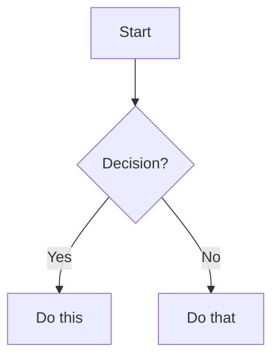

# GitHub for Non-Coders — Deck Research

> **Audience:** Innovation Fellows (gov employees, novice tech users)
> **Interface scope:** GitHub web UI only — no CLI, no desktop apps
> **Markdown rendering:** GitHub's built-in rendering only
> **Use cases:** Knowledge bases / documentation, policy & procedure tracking
> **Date compiled:** 2026-02-12

---

## 1. What Is GitHub, Really?

### The Elevator Pitch

GitHub is a **collaboration and version control platform** that happens to have been built for code first. Every feature that makes it powerful for software — change tracking, review workflows, branching, audit trails, transparency — applies equally to policy documents, procedures, legal code, and organizational knowledge.

### Scale of Government Adoption

GitHub maintains an official directory at [government.github.com/community](https://government.github.com/community/) tracking government use:

| Level | Count |
|:------|------:|
| U.S. federal organizations | 164 |
| U.S. state organizations | 52 |
| U.S. city organizations | 66 |
| U.S. county organizations | 18 |
| U.S. military & intelligence orgs | 17 |
| **Total U.S. government GitHub orgs** | **362+** |

Notable agencies: NASA, CDC, USDA, EPA, GSA, VA, White House, California (@cagov), Massachusetts (@massgov), New York (@ny), NYC, Los Angeles, Chicago, San Francisco.

### Landmark Non-Code Government Examples

**White House — Federal Source Code Policy**
The White House published the [Federal Source Code Policy](https://github.com/WhiteHouse/source-code-policy) directly on GitHub. Public comments happened through GitHub Issues — not email, not PDF comment forms. Issue threads like [#73 (Open source by default)](https://github.com/whitehouse/source-code-policy/issues/73) show the public engaging directly with policy drafts.

**Washington, D.C. — Entire Legal Code on GitHub**
The [Council of the District of Columbia](https://github.com/DCCouncil) publishes D.C.'s legal code at [DCCouncil/dc-law](https://github.com/DCCouncil/dc-law). This is the **authoritative source**, not a mirror. As DCist reported: *"The District does something with its legal code that no other jurisdiction in the world does: it publishes the law on GitHub."*

**18F/GSA — TTS Handbook (Employee Policies & Operations)**
The [GSA-TTS/handbook](https://github.com/GSA-TTS/handbook) is the entire Technology Transformation Services employee handbook — policies, onboarding, leave, hiring, tools, values — published as open source. It is described as *"open, crowd-sourced, accessible, and living."* Anyone, including the public, can submit pull requests to fix outdated content. 18F's blog calls it *"a 21st-century approach to internal documentation."*

**California — Open Source Portal**
California runs [code.ca.gov](https://www.code.ca.gov/) as its open source portal. The [Office of Data and Innovation (@cagov)](https://github.com/cagov) maintains repos including the official COVID-19 response website and CA.gov development work.

**Project Open Data**
The [project-open-data](https://github.com/project-open-data/project-open-data.github.io) repository manages the federal Open Data Policy ("Managing Information as an Asset") as a living document on GitHub.

**Digital.gov Training**
The federal government's own [Digital.gov](https://digital.gov/resources/an-introduction-github) publishes "An Introduction to GitHub" as a government training resource with video tutorials.

### What GitHub Is Good For (Non-Code)

- **Knowledge bases and documentation** — READMEs, wikis, guides, SOPs
- **Policy and procedure tracking** — version-controlled documents with full audit trails
- **Project management** — Issues, project boards, task tracking
- **Public transparency** — open repos let citizens see how decisions are made
- **Cross-team collaboration** — pull requests as structured review workflows

---

## 2. What Is Markdown?

### Origin Story

Markdown is a plain-text formatting language created in **2004** by **John Gruber** (technology writer/blogger) in collaboration with **Aaron Swartz** (internet activist, co-founder of Reddit). Released December 17, 2004.

**Why it was created:** Gruber wanted people to *"write using an easy-to-read and easy-to-write plain text format"* that could be converted to HTML. The biggest inspiration was **how people already formatted plain-text emails** — asterisks for emphasis, dashes for lists, blank lines for paragraphs. Markdown formalized what people were already doing naturally.

**How it works:** You write in plain text and add simple symbols for formatting:
- `# Heading` becomes a heading
- `**bold**` becomes **bold**
- `- item` becomes a bullet point

### Scale of Adoption Today

Markdown is used across GitHub, Reddit, Stack Overflow, Notion, Slack, Discord, nearly every documentation platform, and every major AI tool. It is the de facto language of the internet's written content.

### Analogy for Non-Technical People

Think of it like writing a note on paper. If you underline a word, you mean emphasis. If you put a dash before a line, you mean a list. Markdown works the same way, except a computer can also understand the intent and render it with proper formatting.

---

## 3. Markdown vs. Microsoft Word

### Side-by-Side Comparison

| Dimension | Markdown | Microsoft Word |
|:----------|:---------|:---------------|
| **File format** | Plain text (.md). Open in Notepad, TextEdit, any editor on any device. | Binary/XML archive (.docx). Requires Word or compatible app. |
| **File size** | 10-page doc ≈ 15–20 KB | Same doc in Word ≈ 50–200 KB+ (embedded metadata, styles, XML) |
| **Portability** | Windows, Mac, Linux, phone, Raspberry Pi, 20-year-old computer. Any device that displays text. | Requires Word, Google Docs (with conversion), or LibreOffice. Formatting may shift. |
| **Vendor lock-in** | None. No company owns plain text. | Tied to Microsoft's ecosystem. Full-fidelity rendering depends on Word. |
| **Version control** | Every change visible as human-readable line-by-line diff. | Binary format = meaningless diffs. Track Changes is app-internal. |
| **Collaboration** | Multiple editors, straightforward merging. | SharePoint/OneDrive or emailing files. Track Changes unwieldy at scale. |

### Key Analogies

**The Sealed Package Analogy:** A Word document is like a sealed package — you need the right tool to open it, and if the tool changes, the package might not open cleanly. A markdown file is like a postcard — anyone can read it, anywhere, anytime, with nothing special required.

**The Recipe Analogy:** Raw markdown is like seeing the recipe for a cake — flour, sugar, eggs, instructions. It's not the cake itself, but anyone can read the recipe and understand what the cake will be. Word is like seeing the finished cake with no idea what's inside. The recipe (markdown) is more transparent, even if the finished cake (rendered output) looks prettier.

### The Compatibility Tax

Word has gone through multiple incompatible formats (.doc, .docx, various internal versions). Users regularly encounter "Compatibility Mode" warnings. Markdown's underlying format (UTF-8 plain text) is backward-compatible to 1963.

### What Markdown Can't Do Well (Be Honest)

| Limitation | Details |
|:-----------|:--------|
| **Complex tables** | No merged cells (rowspan/colspan). Must always have header row. Cells can't contain paragraphs or nested lists. |
| **Charts & data viz** | Zero native support. Must embed images or use Mermaid diagrams. |
| **Precise print layout** | No page breaks, margins, headers/footers, columns, font control. |
| **Rich media** | Can link to images, but no embedded video/audio natively. |
| **Form fields** | Word supports form fields, content controls, macros. Markdown is static. |

**The practical answer:** Markdown is ideal for drafting, collaborating, documenting, and feeding content to AI. Word remains necessary for final-format deliverables requiring precise layout, complex tables, or embedded charts. Many teams **draft in markdown and export to Word/PDF** for final distribution.

---

## 4. Why Markdown Is Better for AI

This is arguably the most consequential finding for a government audience evaluating AI adoption.

### LLMs Read and Write Markdown Natively

Every major AI system — ChatGPT, Claude, Gemini, Copilot — **outputs markdown by default**. When you ask AI to write a document, it produces markdown. When you feed AI a document, markdown is the cleanest input format. This is not coincidental — it's baked into how these models were built.

### Key Facts

**Training data:** ~85% of AI training datasets use markdown as their primary text format. Models like GPT-4 and Claude were extensively trained on markdown content from GitHub, Stack Overflow, and documentation sites. Markdown is literally the language AI grew up reading.

**Token efficiency:** A heading in markdown costs ~3 tokens (`# My Title`). The same heading in HTML costs 23+ tokens (`<h1 class="title-large font-bold text-xl">My Title</h1>`). Fewer tokens = faster processing, lower cost, more room for actual content.

**No conversion overhead:** Give AI a Word document → system must convert it to text, often losing structure, mangling tables, introducing errors. Give AI markdown → zero conversion. What you wrote is what the AI reads.

**Structural clarity:** Markdown's hierarchy (`##` = subheading) gives AI clear signals about information organization. With Word, AI must infer structure from visual formatting metadata that may be inconsistent.

**The llms.txt standard:** In 2024, AI researcher Jeremy Howard proposed `llms.txt` — a markdown file websites place at their root to help AI understand their content. 600+ major websites adopted it (Anthropic, Stripe, Cloudflare, Zapier, Hugging Face). The standard chose markdown over every other format.

### The AI Analogy

Imagine hiring a new employee who speaks fluent Spanish. You could hand them instructions in Spanish (markdown), or instructions in English inside a locked briefcase requiring a special key (Word). Both contain the same information, but one is immediately usable.

---

## 5. Why Markdown Is Better for Version Control

### The Core Problem with Word

Git compares the previous version of a file to the new version and shows what changed. With **plain text (markdown)**, this comparison is human-readable:

```
- The deadline is March 15, 2026.
+ The deadline is April 1, 2026.
```

Anyone can see that someone changed the deadline. With a **Word document**, the same change produces a binary diff — a wall of incomprehensible machine code.

### Practical Consequences

| Issue | Markdown | Word |
|:------|:---------|:-----|
| **Storage** | Git saves only changed lines. 100 revisions stays small. | Git saves entire file copy per change. Grows enormously. |
| **Merging** | Two editors → Git often merges automatically. | Two editors → binary conflict requiring manual resolution in Word. |
| **Audit trail** | Line-by-line history. Complete, transparent, reviewable. | Track Changes is app-internal, can be accepted/rejected/cleared — unreliable as audit record. |
| **File naming** | One file, complete history in Git. | `Policy_v3_FINAL_FINAL_revised.docx` syndrome. |

### The Security Camera Analogy

Tracking changes in Word is like filming through a frosted window — you know something happened but can't make out details. Tracking changes in markdown is like filming through clear glass — every edit is visible, attributable, and reviewable.

---

## 6. Longevity and Portability

### The 22-Year Test

A markdown file written in 2004 opens perfectly today on any device, any OS, without compatibility mode, conversion, or special software. Try a Word doc from 2004 — you'll likely encounter compatibility warnings, formatting shifts, or missing fonts.

### Why This Matters for Government

Government documents have retention requirements measured in **decades**. Some records must be preserved for 30, 50, or 75 years. Betting those records on a proprietary format controlled by a single company is a long-term risk. Plain text has been readable since the 1960s.

### Key Points

- Markdown files can't become "corrupted" the way Word's complex XML structure can
- A `.md` file will be readable in 50 years with nothing more than a basic text editor
- UTF-8 encoding is backward-compatible to ASCII from 1963
- There is no such thing as "Markdown 2004 compatibility mode"

### The Photo Analogy

A Word document is like storing family photos on a proprietary memory card that only works with one brand of camera. A markdown file is like printing photos on paper — the technology to view it will never go obsolete.

---

## 7. The "Scary Code Editor" Perception

### The Honest Truth

When non-technical people see raw markdown for the first time, it looks like code. They see `##`, `**`, `- [ ]`, and think "this is for programmers." This is the single biggest adoption barrier.

### Why the Fear Is Overblown

1. **Markdown was designed to be readable raw.** Gruber's key goal: *"readable as-is, without looking like it has been marked up with tags or formatting instructions."* Compare `**important**` to HTML's `<strong>important</strong>`.

2. **The entire syntax for 90% of daily use fits on an index card.** `#` for headings, `**` for bold, `-` for lists, `>` for quotes. That's it.

3. **People already use markdown without knowing it.** If you've put an asterisk before a word in Slack, Teams, WhatsApp, or Discord for emphasis — you've used markdown syntax.

4. **GitHub shows you the rendered result, not the raw text.** When you visit a `.md` file on GitHub, you see the formatted document. You only see the raw syntax when you click "Edit."

### The 10-Minute Claim

Most people learn enough markdown to be productive in **under 10 minutes**. Four symbols cover 90% of use cases.

---

## 8. GitHub Web UI — What Non-Coders Can Do Without CLI

Everything below is done entirely in a web browser. No terminal. No git. No software installation.

### Core Capabilities

| Action | How |
|:-------|:----|
| **Create a repository** | Click green "New" button. Choose public/private. Initialize with README. |
| **Create files** | "Add file" > "Create new file." Name includes path separators for folders: `policies/leave-policy.md` |
| **Edit files** | Click any file → pencil icon → edit in browser → Preview tab → Commit changes |
| **Upload files** | Drag and drop. Up to 100 files, 25 MB each. |
| **Save changes** | "Commit" = save + note about what you changed. Type a description, click button. |
| **View changes** | Additions in green (+), deletions in red (-). Side-by-side or unified view. |
| **Track tasks** | Issues with labels, assignees, milestones. No code knowledge required. |
| **Project boards** | Table, board, or roadmap views. Custom fields. Filter, sort, group. |
| **Discuss** | Discussions feature for brainstorming outside the issue tracker. |

### github.dev — VS Code in the Browser

Press the **period key (`.`)** on any repository page. GitHub opens a full VS Code editor in your browser:
- File explorer sidebar
- Multi-file editing
- Search across the repository
- Markdown preview
- Completely free

### Creating Folder Structure

Type a slash `/` in a filename to create directories automatically. Typing `docs/meeting-notes/2026-02-12.md` creates the `docs/meeting-notes/` folder structure on the fly.

---

## 9. GitHub Features for Policy & Procedure Tracking

### Blame View — "Who Changed This?"

Click "Blame" on any file to see **who last modified each line** and **when**. Invaluable for answering *"who changed this policy language and when?"*

### Commit History — Full Chronological Audit Trail

Every file has a "History" button showing every revision: who changed it, when, what changed (diff), and why (commit message). Any past version can be viewed or restored.

### Pull Request Reviews — Approval Workflows

This is the most powerful feature for policy management:

1. **Proposed change** — Someone creates a PR with their edits
2. **Review process** — Designated reviewers examine changes line-by-line
3. **Three options:** Comment (feedback), Approve (sign off), Request Changes (block until fixed)
4. **Required reviews** — Admins can require 1, 2, or more approvals before acceptance
5. **Authors cannot approve their own changes**
6. **Discussion thread** — Permanent record of *why* the change was approved or rejected

### Branch Protection — Governance Rules

- Prevent direct changes to the official version (main branch)
- Require PR reviews before any change is merged
- Require specific number of approvals
- Block force pushes (prevent history deletion)

### CODEOWNERS — Automatic Reviewer Assignment

Designate specific people/teams as "owners" of specific files or folders:
- Legal team auto-reviews anything in `/policies/legal/`
- HR team auto-reviews `/policies/hr/`
- TTS uses this: *"GitHub teams are assigned as 'owners' of certain folders"*

### GitHub Flow for Policy Changes

| Step | Action |
|:-----|:-------|
| 1 | **Create a branch** — Draft your policy change |
| 2 | **Make commits** — Edit the document(s) |
| 3 | **Open a pull request** — Propose the change for review |
| 4 | **Review and discuss** — Stakeholders comment, suggest edits, approve |
| 5 | **Merge** — Accepted changes become the official version |
| 6 | **Full audit trail** — Every step is recorded permanently |

### Diff View — Better Than Redlines

Changes displayed with green (additions) and red (deletions). Line-by-line comparison. Shows exact character-level changes. Far more granular than Word's Track Changes.

---

## 10. GitHub-Flavored Markdown (GFM) — The Essentials

### What Gets Rendered Automatically

GitHub renders any `.md` file into formatted HTML when viewed. `README.md` is magic — if it exists in a folder, GitHub displays it as the folder's homepage.

### Syntax Cheat Sheet for Beginners

```markdown
# Heading 1 (largest)
## Heading 2
### Heading 3

**bold text**
*italic text*
~~strikethrough~~

- Bullet point
  - Nested (indent 2 spaces)

1. Numbered item
2. Second item

[Link text](https://example.com)


> Blockquote — great for callouts

---  (horizontal rule)
```

### GFM Extras — What Makes GitHub Special

**Task lists (interactive checkboxes):**
```markdown
- [x] Completed task
- [ ] Incomplete task
```

**Tables:**
```markdown
| Name       | Role         | Status |
|------------|-------------|--------|
| Jane Doe   | Project Lead | Active |
```

**Alerts / Admonitions (colored callout boxes):**
```markdown
> [!NOTE]
> Useful information users should know.

> [!TIP]
> Helpful advice for doing things better.

> [!IMPORTANT]
> Key information users need to achieve their goal.

> [!WARNING]
> Critical content demanding immediate attention.

> [!CAUTION]
> Negative potential consequences of an action.
```
These render as colored boxes — NOTE (blue), TIP (green), IMPORTANT (purple), WARNING (yellow), CAUTION (red). Each has a distinct icon.

**Emoji shortcodes:** `:rocket:` → 🚀, `:star:` → ⭐, `:white_check_mark:` → ✅

**@mentions and auto-linking:** `@username` notifies a person, `#123` links to an issue.

**Footnotes:**
```markdown
This claim needs a source[^1].
[^1]: Source: U.S. Census Bureau, 2024 report.
```

**Mermaid diagrams (flowcharts from text):**
````markdown

````
GitHub renders this as an actual flowchart with boxes and arrows. No image files needed.

**Collapsed sections:**
```markdown
<details>
<summary>Click to expand</summary>
Hidden content here. Full markdown supported inside.
</details>
```

---

## 11. Making Repos Look Professional (No Code Required)

### README Structure That Works

1. Banner image or logo at the top
2. Badges from [Shields.io](https://shields.io/) — status indicators ("Last Updated: Feb 2026")
3. One-line description
4. Table of contents with anchor links
5. Main content — organized with headers, lists, tables, images
6. Contributors section
7. License statement

### Folder Organization Pattern

```
my-repo/
  README.md          (the homepage)
  docs/              (additional documentation)
    getting-started.md
    faq.md
  images/            (screenshots, diagrams)
  resources/         (PDFs, templates)
  LICENSE
```

### GitHub Pages — Free Website from Markdown

1. Create a repository
2. Go to Settings > Pages
3. Select branch to publish from
4. Site goes live at `https://username.github.io/reponame/`
5. Add `_config.yml` with `theme: minima` for instant styling

No server, no hosting bills, no expiration. Free HTTPS. Custom domain support.

---

## 12. Beautiful Non-Code Repos — Proof It Works

### "Awesome" Lists (Pure Markdown, Massive Followings)

| Repository | Stars | What It Is |
|:-----------|------:|:-----------|
| [sindresorhus/awesome](https://github.com/sindresorhus/awesome) | 337k+ | Master list of curated lists |
| [public-apis](https://github.com/public-apis/public-apis) | 300k+ | Free APIs. Pure markdown tables. |
| [free-programming-books](https://github.com/EbookFoundation/free-programming-books) | 340k+ | Free learning resources in dozens of languages |
| [awesome-selfhosted](https://github.com/awesome-selfhosted/awesome-selfhosted) | 200k+ | Self-hosted software/services |

These prove a well-organized markdown document can attract hundreds of thousands of followers — with zero code.

### Government & Civic Repos

| Repository | Organization |
|:-----------|:-------------|
| [Digital Services Playbook](https://github.com/usds/playbook) | U.S. Digital Service |
| [development-guide](https://github.com/18F/development-guide) | 18F (GSA) |
| [data.gov](https://github.com/GSA/data.gov) | U.S. GSA |
| [CyberChef](https://github.com/gchq/CyberChef) | UK GCHQ |
| [Government Apps Collection](https://github.com/collections/government) | GitHub (curated) |

---

## 13. Common Objections & Responses

### "GitHub is too technical / intimidating"

**Reality:** The web UI requires zero command-line knowledge. You edit text and click buttons. The federal government's own [Digital.gov](https://digital.gov/resources/an-introduction-github) publishes training resources specifically for non-technical staff.

### "The jargon is confusing"

Map to familiar concepts:
| Git Term | Plain English |
|:---------|:-------------|
| **Repository** | A folder containing related files |
| **Commit** | "Save" + a note about what you changed |
| **Branch** | A draft copy you work on before it's final |
| **Pull request** | "Please review my changes before they go live" |
| **Merge** | Accepting reviewed changes into the official version |
| **Diff** | Redline / Track Changes view |

### "Our staff won't learn a new tool"

The [github.dev editor](https://docs.github.com/en/codespaces/the-githubdev-web-based-editor) (press `.` on any repo) provides a familiar editor in the browser. CMS layers like Prose.io add rich formatting toolbars. And the formatting toolbar exists in every GitHub comment field already.

### "We already use SharePoint / Google Drive"

Those tools lack line-level change tracking, structured review workflows, and public transparency. They create "which version is the latest?" confusion. GitHub's branching model eliminates `Policy_v3_FINAL_FINAL_revised.docx` syndrome.

### "Markdown is too limited"

GFM supports headers, bold, italic, tables, task lists, images, links, alerts, footnotes, and diagrams. For 95% of policy and documentation purposes, this covers everything. For the remaining 5%, export to Word/PDF.

### "Security concerns about public repos"

GitHub offers private repositories. Organizations control access at repository, team, and individual levels. Branch protection rules prevent unauthorized changes.

---

## 14. Suggested Deck Flow (For Later)

Based on the research, a natural narrative arc for the presentation:

1. **Hook** — "362+ government orgs already use GitHub. Here's why."
2. **What is GitHub?** — Collaboration platform, not just a coding tool. D.C. publishes law there.
3. **Why should you care?** — Version control, transparency, AI-readiness, longevity.
4. **What is Markdown?** — Plain text with simple formatting. You already use it (Slack, Teams).
5. **Markdown vs. Word** — Side-by-side comparison. Honesty about limitations.
6. **Why Markdown matters for AI** — LLMs speak markdown natively. Token efficiency. llms.txt.
7. **GitHub's web UI** — Demo of creating/editing files, preview, committing. All in browser.
8. **Making it look good** — How GitHub renders markdown. Alerts, tables, task lists, Mermaid.
9. **Policy tracking superpowers** — Blame, history, pull requests, CODEOWNERS.
10. **Real examples** — Awesome lists, government repos, GitHub Pages.
11. **Getting started** — Jargon translator. First steps. Resources.

---

## Sources

### Government Use Cases
- [government.github.com/community](https://government.github.com/community/)
- [WhiteHouse/source-code-policy](https://github.com/WhiteHouse/source-code-policy)
- [DCCouncil/dc-law](https://github.com/DCCouncil/dc-law)
- [GSA-TTS/handbook](https://github.com/GSA-TTS/handbook)
- [18F Blog: TTS Handbook](https://18f.gsa.gov/2021/07/27/the_tts_handbook_a_21st-century_approach_to_internal_documentation/)
- [Digital.gov: Introduction to GitHub](https://digital.gov/resources/an-introduction-github)
- [code.ca.gov](https://www.code.ca.gov/)

### Markdown vs. Word
- [Ben Balter: Word versus Markdown](https://ben.balter.com/2014/03/31/word-versus-markdown-more-than-mere-semantics/)
- [Markdown Guide: Getting Started](https://www.markdownguide.org/getting-started/)
- [Wikipedia: Markdown](https://en.wikipedia.org/wiki/Markdown)
- [Daring Fireball: Markdown](https://daringfireball.net/projects/markdown/)

### Markdown and AI
- [Markdown Converters: Why Markdown Is Ideal for AI & LLMs](https://markdownconverters.com/blog/markdown-for-ai)
- [Webex Developers: LLM-Friendly Content in Markdown](https://developer.webex.com/blog/boosting-ai-performance-the-power-of-llm-friendly-content-in-markdown)
- [llmstxt.org](https://llmstxt.org/)

### GitHub Features
- [GitHub Docs: Basic Formatting Syntax](https://docs.github.com/en/get-started/writing-on-github/getting-started-with-writing-and-formatting-on-github/basic-writing-and-formatting-syntax)
- [GitHub Docs: github.dev Editor](https://docs.github.com/en/codespaces/the-githubdev-web-based-editor)
- [GitHub Docs: About Protected Branches](https://docs.github.com/en/repositories/configuring-branches-and-merges-in-your-repository/managing-protected-branches/about-protected-branches)
- [GitHub Docs: About Code Owners](https://docs.github.com/articles/about-code-owners)
- [GitHub Docs: Creating Diagrams](https://docs.github.com/en/get-started/writing-on-github/working-with-advanced-formatting/creating-diagrams)

### Non-Code Repo Examples
- [sindresorhus/awesome](https://github.com/sindresorhus/awesome)
- [matiassingers/awesome-readme](https://github.com/matiassingers/awesome-readme)
- [Shields.io](https://shields.io/)
- [GitHub Pages](https://pages.github.com/)
- [GitHub Government Collection](https://github.com/collections/government)
