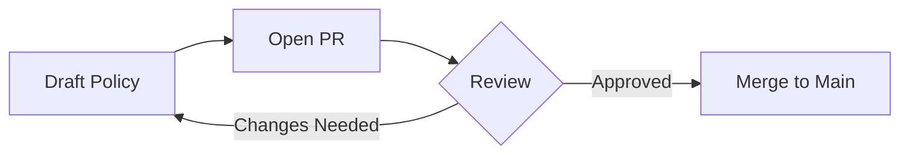

# GitHub for Non-Coders

A New Document Management Technique for AI

<p class="thesis"><strong>Core Thesis:</strong> GitHub isn't a coding tool — it's a collaboration platform with superpowers for documents, policies, and knowledge. 362+ government orgs already use it.</p>
<p class="meta">Innovation Fellowship · February 2026</p>

<style>
/* ── Stat Cards ── */
.stat-row {
  display: flex;
  gap: 1rem;
  margin: 1.5rem 0;
  flex-wrap: wrap;
}
.stat-card {
  flex: 1;
  min-width: 140px;
  background: rgba(255,255,255,0.04);
  border-radius: 10px;
  padding: 1rem 1.2rem;
  text-align: center;
  border-top: 3px solid #4a9eff;
}
.stat-card.gold { border-top-color: #d4a04a; }
.stat-card.green { border-top-color: #55f09a; }
.stat-card .stat-number {
  font-size: 2rem;
  font-weight: 700;
  color: #f2f2f8;
  line-height: 1.1;
}
.stat-card .stat-label {
  font-size: 0.9rem;
  color: #a5a5b8;
  margin-top: 0.25rem;
}

/* ── Comparison Grid ── */
.compare-grid {
  display: grid;
  grid-template-columns: 1fr 1fr;
  gap: 1rem;
  margin: 1rem 0;
  text-align: left;
}
.compare-card {
  background: rgba(255,255,255,0.04);
  border-radius: 10px;
  padding: 1rem;
  border-top: 3px solid #4a9eff;
}
.compare-card.gold { border-top-color: #d4a04a; }
.compare-card h4 { margin: 0 0 0.5rem 0; font-size: 1.05rem; }
.compare-card p, .compare-card li { font-size: 1rem; line-height: 1.5; }
.compare-card ul { padding-left: 1.2rem; margin: 0.5rem 0 0 0; }

/* ── Step Cards ── */
.step-card {
  background: rgba(255,255,255,0.04);
  border-radius: 10px;
  padding: 0.8rem 1rem;
  margin-bottom: 0.5rem;
  border-left: 3px solid #4a9eff;
  text-align: left;
}
.step-card .step-label {
  color: #4a9eff;
  font-weight: 600;
  font-size: 0.85rem;
  text-transform: uppercase;
  letter-spacing: 0.05em;
  margin-bottom: 0.15rem;
}
.step-card.gold { border-left-color: #d4a04a; }
.step-card.gold .step-label { color: #d4a04a; }
.step-card p { margin: 0; font-size: 1.05rem; }

/* ── Jargon Table ── */
.jargon-row {
  display: flex;
  align-items: center;
  gap: 1rem;
  padding: 0.65rem 0;
  border-bottom: 1px solid rgba(255,255,255,0.06);
}
.jargon-row:last-child { border-bottom: none; }
.jargon-term {
  font-family: 'JetBrains Mono', monospace;
  color: #d090ff;
  font-weight: 600;
  font-size: 1.05rem;
  min-width: 130px;
}
.jargon-arrow { color: #4a9eff; font-size: 1.1rem; }
.jargon-meaning { color: #f2f2f8; font-size: 1.05rem; }

/* ── Syntax demo ── */
.syntax-demo {
  display: grid;
  grid-template-columns: 1fr 1fr;
  gap: 1.5rem;
  margin: 1rem 0;
}
.syntax-col {
  background: rgba(255,255,255,0.03);
  border-radius: 10px;
  padding: 1rem 1.2rem;
}
.syntax-col h4 {
  margin: 0 0 0.75rem 0;
  font-size: 0.95rem;
  text-transform: uppercase;
  letter-spacing: 0.05em;
}
.syntax-col.raw h4 { color: #d090ff; }
.syntax-col.rendered h4 { color: #55f09a; }
.syntax-col pre {
  margin: 0;
  padding: 0.75rem;
  font-size: 0.9rem;
  background: rgba(0,0,0,0.3);
  border-radius: 6px;
}
.syntax-col pre code { font-size: 0.9rem; }
.syntax-col .rendered-preview {
  padding: 0.5rem 0;
  font-size: 1rem;
  line-height: 1.6;
}

/* ── Feature highlight badge ── */
.feature-badge {
  display: inline-block;
  background: rgba(74, 158, 255, 0.15);
  color: #4a9eff;
  padding: 0.15rem 0.5rem;
  border-radius: 4px;
  font-size: 0.9rem;
  font-weight: 600;
}
.feature-badge.gold { background: rgba(212,160,74,0.15); color: #d4a04a; }
.feature-badge.green { background: rgba(85,240,154,0.15); color: #55f09a; }

/* ── Gov callout ── */
.gov-callout {
  background: rgba(212, 160, 74, 0.1);
  border-left: 3px solid #d4a04a;
  border-radius: 0 8px 8px 0;
  padding: 0.75rem 1rem;
  margin: 0.75rem 0;
  text-align: left;
  font-size: 1.05rem;
}
.gov-callout strong { color: #d4a04a; }

/* ── Icon cards for web UI features ── */
.ui-grid {
  display: grid;
  grid-template-columns: repeat(3, 1fr);
  gap: 0.75rem;
  margin: 1rem 0;
}
.ui-card {
  background: rgba(255,255,255,0.04);
  border-radius: 10px;
  padding: 0.8rem 1rem;
  text-align: center;
  border-bottom: 2px solid #4a9eff;
}
.ui-card .ui-icon { font-size: 1.5rem; margin-bottom: 0.3rem; }
.ui-card .ui-title { font-weight: 600; font-size: 1rem; color: #f2f2f8; margin-bottom: 0.2rem; }
.ui-card .ui-desc { font-size: 0.9rem; color: #a5a5b8; line-height: 1.3; }
</style>

---

## What Is GitHub?

GitHub is not a programming tool. It's a **collaboration and version control platform** that the software industry built — and that anyone can use for documents, policies, and knowledge management.

<div class="stat-row">
<div class="stat-card gold"><div class="stat-number">362+</div><div class="stat-label">U.S. Gov Orgs on GitHub</div></div>
<div class="stat-card"><div class="stat-number">164</div><div class="stat-label">Federal Agencies</div></div>
<div class="stat-card green"><div class="stat-number">52</div><div class="stat-label">State Organizations</div></div>
</div>

That includes NASA, CDC, EPA, GSA, the VA, the White House, and California's own **Office of Data and Innovation** (@cagov).

<div class="compare-grid">
<div class="compare-card">
<h4>Public Repos</h4>
<p>Visible to everyone. Anyone can read, comment, and suggest changes. Used for transparency, open policy, and public comment periods.</p>
</div>
<div class="compare-card gold">
<h4>Private Repos</h4>
<p>Visible only to your team. Draft sensitive documents internally, then flip to public when ready for review. Same tools, same workflow.</p>
</div>
</div>

### Real Government Examples (No Code)

- **Washington, D.C.** publishes its [entire legal code](https://github.com/DCCouncil/law-xml) on GitHub — the only jurisdiction in the world that does this
- **The White House** used GitHub Issues for [public comment on the Federal Source Code Policy](https://github.com/WhiteHouse/source-code-policy)
- **GSA's [TTS Handbook](https://github.com/18F/handbook)** — all employee policies, onboarding, leave, hiring — is an open GitHub repo anyone can propose edits to
- **California** runs [code.ca.gov](https://code.ca.gov) as its open source portal

> **Key idea:** If the White House, D.C. Council, and GSA trust GitHub for policy and legal text, it's not "just for coders."

---

## Why Should You Care?

GitHub solves problems you deal with every day — you just might not know it yet.

<div class="compare-grid">
<div class="compare-card">
<h4>The Problem</h4>
<ul>
<li><code>Policy_v3_FINAL_FINAL_revised.docx</code></li>
<li>"Who changed this? When? Why?"</li>
<li>Emailing files back and forth</li>
<li>"Which version is the latest?"</li>
<li>Documents trapped in one person's laptop</li>
</ul>
</div>
<div class="compare-card gold">
<h4>GitHub's Answer</h4>
<ul>
<li>One file. Complete history. Forever.</li>
<li>Every change tracked: who, when, why</li>
<li>Everyone works from the same source</li>
<li>There's only one version — the latest</li>
<li>Everything is accessible from any browser</li>
</ul>
</div>
</div>

Plus two bonuses that are becoming critical:

- **AI-readiness** — Every major AI tool (Claude, ChatGPT, Copilot) reads and writes the same format GitHub uses natively
- **Longevity** — Files on GitHub are plain text. They'll be readable in 50 years without any special software

---

## What Is Markdown?

Markdown is the format you'll write in on GitHub. It's **plain text with simple formatting symbols** — and you already use it without knowing it.

### You Already Know This

If you've ever typed `**bold**` in Slack, `*italic*` in Teams, or used a `-` for a bullet point in a text message — **you've used markdown syntax.**

Markdown was created in 2004 by John Gruber with one goal: make plain text *"readable as-is, without looking like it has been marked up with tags or formatting instructions."*

### The Entire Syntax for 90% of Your Work

| You Type | You Get | Purpose |
|----------|---------|---------|
| `# Title` | A large heading | Page titles |
| `## Section` | A medium heading | Sections |
| `**bold**` | **bold text** | Emphasis |
| `*italic*` | *italic text* | Lighter emphasis |
| `- item` | A bullet point | Lists |
| `1. item` | A numbered item | Ordered lists |
| `[text](url)` | A clickable link | References |
| `> quote` | An indented quote | Callouts |

That's it. **Eight patterns.** Everything else is optional.

:::collapse What about the other 10%?
Tables, task lists, images, code blocks, and footnotes make up the advanced syntax. You'll pick them up naturally as you use GitHub. None of them are required to get started.

| You Type | You Get |
|----------|---------|
| `- [x] Done` | A checked checkbox |
| `- [ ] Todo` | An unchecked checkbox |
| `` | An embedded image |
| `` `code` `` | Inline code styling |
| `---` | A horizontal line |
:::

---

## Markdown vs. Word

Markdown isn't trying to replace Word. But for **drafting, collaborating, and feeding content to AI**, it's genuinely better. Here's an honest comparison.

<div class="compare-grid">
<div class="compare-card">
<h4>Microsoft Word (.docx)</h4>
<ul>
<li>Binary file — needs Word to open properly</li>
<li>50–200 KB for a 10-page doc</li>
<li>Formatting breaks between versions</li>
<li>"Compatibility Mode" warnings</li>
<li>Track Changes is internal and deletable</li>
<li>Vendor lock-in (Microsoft ecosystem)</li>
</ul>
</div>
<div class="compare-card gold">
<h4>Markdown (.md)</h4>
<ul>
<li>Plain text — opens in any app, any device</li>
<li>15–20 KB for the same document</li>
<li>No formatting drift. Ever.</li>
<li>Zero compatibility issues since 2004</li>
<li>Change history is permanent and external</li>
<li>No vendor — no company owns plain text</li>
</ul>
</div>
</div>

> **The postcard analogy:** A Word document is like a sealed package — you need the right tool to open it, and if the tool changes, the package might not open cleanly. A markdown file is like a postcard — anyone can read it, anywhere, anytime.

### Where Word Still Wins

Be honest: markdown **can't** do complex merged tables, embedded charts, precise print layouts, or form fields. For final-format deliverables with strict formatting, Word is the right tool. The move is to **draft in markdown** (where collaboration and version control are easy) and **export to Word/PDF** for final distribution.

---

## Why Markdown Matters for AI

This is the slide that changes how you think about document formats.

Every major AI system — Claude, ChatGPT, Gemini, Copilot — **outputs markdown by default**. When you ask an AI to write a document, it writes markdown. When you feed an AI a document to analyze, markdown is the cleanest input.

### Why?

- **~85% of AI training data** uses markdown as its primary text format. It's literally the language AI grew up reading.
- **Token efficiency:** AI reads text in chunks called *tokens* (roughly one token per word). `# My Title` costs ~3 tokens. The same heading in Word's internal XML costs 23+ tokens — mostly invisible formatting junk. Fewer tokens = faster responses, lower cost, more room for your actual content.
- **Zero conversion:** Feed AI a Word doc → it must convert first, losing structure and mangling tables. Feed AI markdown → it reads it instantly, as-is.
- **600+ websites** (including Anthropic, Stripe, Cloudflare) now publish [`llms.txt`](https://llmstxt.org/) files — in markdown — specifically so AI can read their content.

<div class="gov-callout">
<strong>What this means for you:</strong> As your agency adopts AI tools, documents in markdown are immediately usable. Documents in Word need conversion — every single time. Markdown is the native language of AI.
</div>

> **The bilingual analogy:** Imagine hiring someone who speaks fluent Spanish. You can hand them instructions in Spanish (markdown), or instructions in English inside a locked briefcase that needs a special key (Word). Same information — only one is immediately usable.

---

## "But It Looks Like Code..."

Let's address the elephant in the room. When you see raw markdown for the first time, it looks technical. Here's what you're actually seeing.

<div class="syntax-demo">
<div class="syntax-col raw">
<h4>What You Type</h4>
<pre><code># Meeting Notes
### Action Items
- **Jane** will draft the policy
- **Mike** will review by Friday
- ~~Old task~~ (completed)
> Important: deadline is March 15
[Link to policy](https://example.com)</code></pre>
</div>
<div class="syntax-col rendered">
<h4>What GitHub Shows</h4>
<div class="rendered-preview">
<h3 style="margin:0 0 0.5rem;font-size:1.1rem;color:#f2f2f8;">Meeting Notes</h3>
<h4 style="margin:0 0 0.5rem;font-size:0.95rem;color:#78b8ff;">Action Items</h4>
<ul style="padding-left:1.2rem;margin:0.3rem 0;font-size:0.9rem;">
<li><strong>Jane</strong> will draft the policy</li>
<li><strong>Mike</strong> will review by Friday</li>
<li><s>Old task</s> (completed)</li>
</ul>
<div style="border-left:3px solid #4a9eff;padding:0.3rem 0.6rem;margin:0.5rem 0;font-size:0.85rem;background:rgba(74,158,255,0.08);border-radius:0 6px 6px 0;">Important: deadline is March 15</div>
<a href="#" style="color:#78b8ff;font-size:0.9rem;">Link to policy</a>
</div>
</div>
</div>

**The left side is what you write. The right side is what everyone else sees.** GitHub automatically renders it. You never have to look at the raw text unless you're editing.

### Three Reasons the Fear Is Overblown

1. **You already use it.** Slack, Teams, WhatsApp, and Discord all support markdown formatting. You've been writing it for years.
2. **It was designed to be readable raw.** Unlike HTML (`<strong>important</strong>`), markdown (`**important**`) is intuitive even before rendering.
3. **Most people learn enough in 10 minutes.** Four symbols handle 90% of daily work.

---

## Everything Happens in Your Browser

Here's the part that surprises people: **you never need to install anything**. Everything on GitHub works in a web browser. No terminal. No command line. No software downloads.

<div class="ui-grid">
<div class="ui-card"><div class="ui-icon">📁</div><div class="ui-title">Create a Repo</div><div class="ui-desc">Click "New" button. Name it. Done.</div></div>
<div class="ui-card"><div class="ui-icon">📝</div><div class="ui-title">Create Files</div><div class="ui-desc">"Add file" → type content → save</div></div>
<div class="ui-card"><div class="ui-icon">✏️</div><div class="ui-title">Edit Files</div><div class="ui-desc">Click pencil icon → make changes</div></div>
<div class="ui-card"><div class="ui-icon">👁️</div><div class="ui-title">Preview</div><div class="ui-desc">See rendered markdown before saving</div></div>
<div class="ui-card"><div class="ui-icon">💾</div><div class="ui-title">Save (Commit)</div><div class="ui-desc">Type what you changed. Click button.</div></div>
<div class="ui-card"><div class="ui-icon">📂</div><div class="ui-title">Create Folders</div><div class="ui-desc">Type <code>/</code> in filename — folders auto-create</div></div>
</div>

### The Edit → Preview → Save Workflow

<div class="step-card"><div class="step-label">Step 1</div><p>Navigate to any file and click the <strong>pencil icon</strong> (top right)</p></div>
<div class="step-card"><div class="step-label">Step 2</div><p>Edit the file directly in the browser — there's a <strong>formatting toolbar</strong> so you don't need to memorize syntax</p></div>
<div class="step-card"><div class="step-label">Step 3</div><p>Click the <strong>"Preview"</strong> tab to see your rendered markdown before saving</p></div>
<div class="step-card gold"><div class="step-label">Step 4</div><p>Click <strong>"Commit changes"</strong> — type a short note about what you changed — done</p></div>

Every text box on GitHub (comments, issues, discussions) also has a formatting toolbar. You can click Bold, Italic, List, and Link buttons just like Word.

### The Secret Power Move: Press `.`

On any GitHub repository page, press the **period key** (`.`) on your keyboard. GitHub opens a **full VS Code editor** right in your browser — file explorer, search, multi-file editing, markdown preview. Completely free. Zero installation.

---

## Making It Look Good

Here's the payoff: GitHub takes your plain markdown and renders it beautifully. No design skills required.

### What GitHub Does Automatically

When you create a file called `README.md` in any folder, GitHub displays it as that folder's **homepage** — formatted with headings, bold, tables, images, and colors. It's like having a beautifully designed document that updates itself.

### Features That Make Documents Pop

**Task lists** — interactive checkboxes (people can check them in the browser):
```markdown
- [x] Draft complete
- [x] Legal review passed
- [ ] Director approval pending
```

**Tables** — clean data grids:
```markdown
| Team    | Owner      | Status    |
|---------|-----------|-----------|
| Policy  | Jane Doe  | Active    |
| Ops     | Mike Chen | On Hold   |
```

**Colored alerts** — eye-catching callout boxes:
```markdown
> [!NOTE]
> This policy takes effect March 1, 2026.

> [!WARNING]
> This replaces the previous version entirely.
```

GitHub renders these as colored boxes: **Note** (blue), **Tip** (green), **Important** (purple), **Warning** (yellow), **Caution** (red).

**Mermaid diagrams** — flowcharts from text (no image files needed):



GitHub turns that text into an actual diagram with boxes and arrows. You never create an image file.

:::collapse What else can you do?
- **Emoji shortcodes** — `:rocket:` becomes 🚀, `:white_check_mark:` becomes ✅
- **@mentions** — `@username` notifies someone, just like Slack
- **Issue references** — `#123` auto-links to that issue
- **Footnotes** — `[^1]` creates academic-style references
- **Collapsed sections** — hide long content behind a click-to-expand toggle (like this one)
:::

---

## Policy Tracking Superpowers

This is where GitHub goes from "nice to have" to "why weren't we using this before?" for government teams.

### Every Change Is Tracked — Permanently

| Feature | What It Does | Why It Matters |
|---------|-------------|----------------|
| **Commit History** | Shows every change: who, when, what, and why | Complete audit trail without Track Changes |
| **Blame View** | Shows who last edited each line of a document | "Who changed this policy language?" — answered instantly |
| **Diff View** | Red/green comparison of before and after | Better than Word's redlines — shows exact character-level changes |

### Pull Requests = Structured Approvals

This is the killer feature for policy work. A **pull request** is just a formal way to say: "I'd like to change this document. Please review before it goes live."

<div class="step-card"><div class="step-label">1. Propose</div><p>Someone edits a document and opens a pull request</p></div>
<div class="step-card"><div class="step-label">2. Review</div><p>Reviewers examine changes line-by-line — click any line to comment directly on it</p></div>
<div class="step-card"><div class="step-label">3. Suggest</div><p>Reviewers can <strong>propose exact alternative text</strong> — the author accepts with one click, no rewriting</p></div>
<div class="step-card"><div class="step-label">4. Decide</div><p>Each reviewer submits: <strong>Approve</strong> (sign off), <strong>Request Changes</strong> (block until fixed), or <strong>Comment</strong> (non-blocking feedback)</p></div>
<div class="step-card gold"><div class="step-label">5. Approve</div><p>Required reviewers sign off. Authors <strong>cannot approve their own changes.</strong></p></div>
<div class="step-card green"><div class="step-label">6. Merge</div><p>Approved changes become the official version. Full audit trail preserved.</p></div>

### Why This Beats Track Changes

In Word, a reviewer might circle a sentence and write "this is unclear" — leaving the author to guess what they meant. On GitHub, the reviewer clicks **Suggest Changes**, types the exact wording they want, and the author accepts it with one click. The conversation about *why* is preserved permanently. No ambiguity. No lost feedback. No toggling Track Changes off and erasing the record.

### Governance Controls

- **Branch protection** — Prevent direct edits to the official version. All changes must go through review.
- **Required reviewers** — Set a minimum number of approvals (1, 2, or more) before any change is accepted.
- **CODEOWNERS** — Automatically assign specific reviewers to specific folders. Legal team auto-reviews `/policies/legal/`. HR auto-reviews `/policies/hr/`.

<div class="gov-callout">
<strong>Why this matters:</strong> The frosted window analogy — tracking changes in Word is like filming a security camera through frosted glass. You know something happened, but you can't make out details. GitHub's version control is like filming through clear glass. Every edit is visible, attributable, and reviewable — and unlike Word, the record <strong>cannot be deleted</strong>.
</div>

---

## Proof It Works: Real Examples

These repositories contain **no code at all** — just well-organized markdown. They're among the most popular projects on all of GitHub.

### Pure Markdown, Massive Followings

| Repository | Stars | What It Is |
|-----------|------:|-----------|
| [**awesome**](https://github.com/sindresorhus/awesome) | 337,000+ | Master list of curated lists on every topic |
| [**free-programming-books**](https://github.com/EbookFoundation/free-programming-books) | 340,000+ | Free learning resources in dozens of languages |
| [**public-apis**](https://github.com/public-apis/public-apis) | 300,000+ | Directory of free APIs — pure markdown tables |

These prove that a well-organized markdown document can attract **hundreds of thousands of followers** with zero code.

### Government Repos

| Repository | Organization |
|-----------|-------------|
| [**Digital Services Playbook**](https://github.com/usds/playbook) | U.S. Digital Service |
| [**TTS Handbook**](https://github.com/18F/handbook) | GSA (18F) |
| [**data.gov**](https://github.com/GSA/data.gov) | U.S. GSA |
| [**development-guide**](https://github.com/18F/development-guide) | 18F |

### Bonus: GitHub Pages

You can turn any repo of markdown files into a **free website** at `https://yourname.github.io/reponame/`. Free HTTPS. Custom domain support. No hosting bills. No expiration. The Innovation Fellowship presentations site runs on this exact technology.

---

## The Jargon Translator

Git has its own vocabulary. Here's your cheat sheet — map every term to something you already know.

<div class="jargon-row"><span class="jargon-term">Repository</span><span class="jargon-arrow">→</span><span class="jargon-meaning">A folder that contains your project's files</span></div>
<div class="jargon-row"><span class="jargon-term">Commit</span><span class="jargon-arrow">→</span><span class="jargon-meaning">"Save" + a note explaining what you changed</span></div>
<div class="jargon-row"><span class="jargon-term">Branch</span><span class="jargon-arrow">→</span><span class="jargon-meaning">A draft copy where you experiment before it's official</span></div>
<div class="jargon-row"><span class="jargon-term">Pull Request</span><span class="jargon-arrow">→</span><span class="jargon-meaning">"Please review my changes before they go live"</span></div>
<div class="jargon-row"><span class="jargon-term">Merge</span><span class="jargon-arrow">→</span><span class="jargon-meaning">Accepting reviewed changes into the official version</span></div>
<div class="jargon-row"><span class="jargon-term">Diff</span><span class="jargon-arrow">→</span><span class="jargon-meaning">The redline view — additions in green, deletions in red</span></div>
<div class="jargon-row"><span class="jargon-term">README.md</span><span class="jargon-arrow">→</span><span class="jargon-meaning">The "homepage" file for any folder — GitHub renders it automatically</span></div>
<div class="jargon-row"><span class="jargon-term">Issue</span><span class="jargon-arrow">→</span><span class="jargon-meaning">A task, question, or proposal — like a structured to-do item</span></div>

> **The key insight:** You don't need to learn git (the command-line tool). You need to learn GitHub (the website). They're related but different — and the website handles everything.

---

## Getting Started

You're closer than you think. Here's your first 15 minutes.

<div class="step-card"><div class="step-label">Minute 1</div><p>Go to <strong>github.com</strong> and create a free account (use your .gov email for org benefits)</p></div>
<div class="step-card"><div class="step-label">Minute 2</div><p>Click the green <strong>"New"</strong> button to create your first repository. Check "Add a README file."</p></div>
<div class="step-card"><div class="step-label">Minutes 3-5</div><p>Click the pencil icon on <strong>README.md</strong>. Replace everything with the example below, click <strong>Preview</strong> to see it rendered, then click <strong>Commit changes</strong>.</p></div>

```markdown
# My Team Knowledge Base

## Current Projects
- **Q2 Policy Review** — drafting phase, due June 15
- **Onboarding Guide** — ready for feedback

## Quick Links
- [Our shared drive](https://example.com)
- [Meeting notes](/docs/meetings/)

> [!NOTE]
> This README is the homepage of our repository.
```
<div class="step-card gold"><div class="step-label">Minutes 5-10</div><p>Create a new file: click "Add file" → name it <code>docs/my-first-doc.md</code> → write some content → commit. You just created a folder AND a file.</p></div>
<div class="step-card green"><div class="step-label">Minutes 10-15</div><p>Press <strong>.</strong> (period key) on your repo page. Explore the VS Code editor that opens in your browser. Edit a file, preview it, commit.</p></div>

### Resources

- **Digital.gov** — [An Introduction to GitHub](https://digital.gov/resources/an-introduction-github) (federal training resource with video)
- **GitHub Docs** — [Basic formatting syntax](https://docs.github.com/en/get-started/writing-on-github/getting-started-with-writing-and-formatting-on-github/basic-writing-and-formatting-syntax)
- **Markdown Guide** — [Getting Started](https://www.markdownguide.org/getting-started/)
- **Government on GitHub** — [government.github.com](https://government.github.com/community/)

<div class="gov-callout">
<strong>Remember:</strong> GitHub is not a coding tool that happens to handle documents. It is a collaboration platform that happens to have been built for code first. Every feature that makes it powerful for software — change tracking, review workflows, audit trails, transparency — works exactly the same for your policy documents, knowledge bases, and team documentation.
</div>
