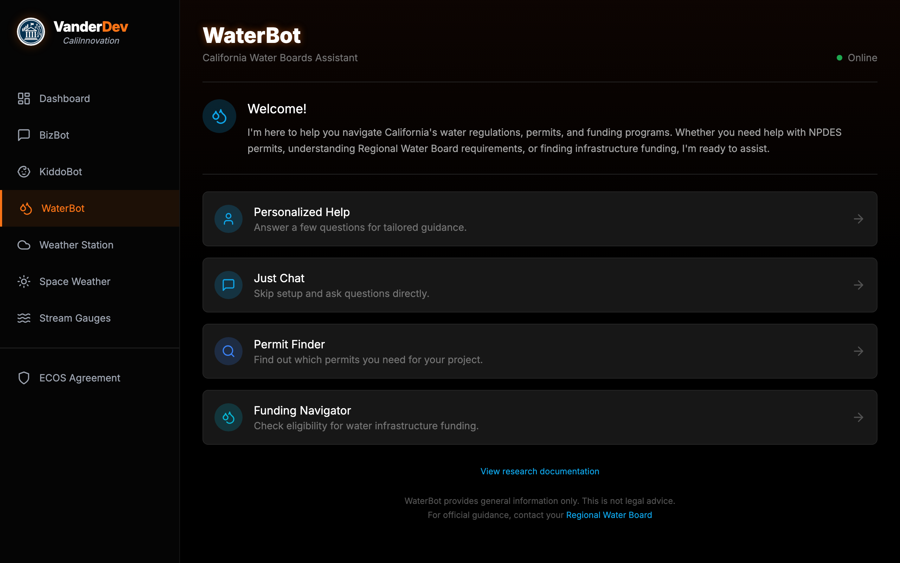
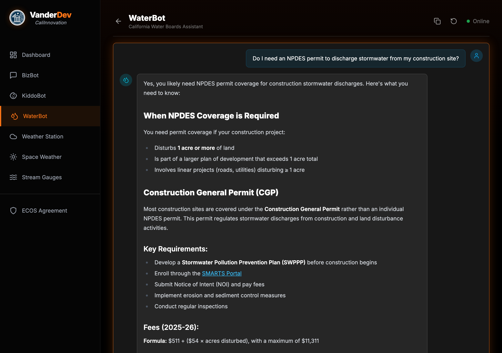

# WaterBot: Building a Government AI Assistant

A RAG Chatbot Case Study for California Water Boards

<strong>Core Thesis:</strong> The AI model is the easy part. The knowledge base is what separates a hallucinating toy from a production system.

February 2026

---

## The Complexity Problem

California's water regulatory landscape: a maze of agencies, permits, and programs that overwhelms the people who need it most.

1

State Water Board

9

Regional Boards

100+

Permit Types

58

Funding Programs

**What if we could give every Californian access to the equivalent of a water regulation expert, 24/7, for free?**

---

## Meet WaterBot

A live, production AI assistant for California Water Boards — four ways to get help.

1
2
3
4
5

1<strong>Personalized Help</strong> — intake form gathers project context first

2<strong>Just Chat</strong> — ask anything about CA water regulations

3<strong>Permit Finder</strong> — interactive decision tree for permit types

4<strong>Funding Navigator</strong> — eligibility checker for infrastructure funding

5<strong>Disclaimer</strong> — always directs to official Regional Board sources

---

## WaterBot in Action

A real conversation — user asks about NPDES permits, WaterBot responds with structured guidance and official links.

1
2
3
4

1<strong>User question</strong> — plain English, no jargon required

2<strong>Structured response</strong> — headings and bullets, not a wall of text

3<strong>Inline link</strong> to SMARTS Portal — actionable, not just informational

4<strong>Fee formula</strong> with current year — grounded in real regulatory data

---

## The Full Experience

**Personalized Help** mode walks users through a 5-step intake so the AI knows their situation before answering.

Step 1 — Project Type

Construction, agricultural, municipal, industrial, or habitat restoration

Step 2 — Location

County selection → maps to the correct Regional Water Board

Step 3 — Discharge Details

Type and volume — determines which permits apply

Step 4 — Water Rights & Federal Nexus

Existing rights? Federal permits? Changes the regulatory path.

Step 5 — Applicant Profile

Business, individual, or municipality — plus DAC status for funding eligibility

---

## The Permit Decision Tree

An interactive decision tree built from a 107KB JSON structure covering every permit pathway.

<h4>How Most People Find Permits</h4>
<ul>
<li>Google "California water permit"</li>
<li>Land on the wrong Regional Board site</li>
<li>Still not sure which permit applies</li>
<li>Give up and call a consultant</li>
</ul>

<h4>How the Decision Tree Works</h4>
<ul>
<li>Answer 4-6 plain-language questions</li>
<li>Get the specific permit type you need</li>
<li>Direct link to the application portal</li>
<li>Total time: under 2 minutes</li>
</ul>

<strong>Design principle:</strong> The tree doesn't replace the regulatory process — it helps people find the right starting point.

---

## The Funding Navigator

58 state and federal funding programs, matched by answering 5 plain-language questions — no AI hallucination risk.

<h4>How Most People Find Funding</h4>
<ul>
<li>Google scattered agency sites</li>
<li>Read 200-page NOFAs</li>
<li>Miss programs they qualify for</li>
<li>Give up and hire a grant writer</li>
</ul>

<h4>How the Navigator Works</h4>
<ul>
<li>Answer 5 questions: org type, project, population, DAC status, matching funds</li>
<li>Get tiered results: <strong>Eligible</strong>, <strong>Likely</strong>, <strong>May Qualify</strong></li>
<li>Direct links to applications</li>
<li>AI enriches results with tips — but matching is deterministic</li>
</ul>

58

Programs Cataloged

5

Questions Asked

3

Eligibility Tiers

<strong>Deterministic matching — no AI hallucination risk.</strong> Hard filters narrow the field; the AI only enriches results with application tips and deadline context.

---

## How It Actually Works: RAG

How It Works

**RAG — Retrieval-Augmented Generation.** Think of it as giving the AI a research assistant who pulls the right files before speaking.

<h4>Without RAG</h4>
<ul>
<li>AI answers from memory (training data)</li>
<li>Can't cite specific sources</li>
<li>Hallucinates confidently</li>
<li>"I think the permit fee is around..."</li>
</ul>

<h4>With RAG</h4>
<ul>
<li>Searches a curated knowledge base first</li>
<li>Every claim cites a real source</li>
<li>Knowledge updates without retraining</li>
<li>"The CGP fee formula is $511 + ($54 × acres)"</li>
</ul>

---

## The Full Architecture

Six systems cooperate in about 2-3 seconds. None are exotic — React, PostgreSQL, and webhook APIs.

👤

User Asks

React frontend

→

🔗

Webhook

n8n receives

→

🔢

Embed

OpenAI 1,536d

→

🔍

Search

pgvector top-8

→

📋

Prompt

Context + query

→

🤖

Response

Claude + citations

<strong>Key insight:</strong> The AI (steps 5-6) is the simplest piece. 80% of the effort is in curating, embedding, and tuning retrieval.

<strong>n8n gotchas:</strong> <code>alwaysOutputData: true</code> prevents silent pipeline death on zero results. <code>escapeBraces()</code> in prompt templates avoids n8n expression collisions. Top-K = 8 chunks.

---

## The Stack

Every component is open-source or free-tier.

⚛️

React + Tailwind

Frontend UI

🔄

n8n

Workflow automation

🧠

OpenAI Embeddings

text-embedding-3-small

🗄️

PostgreSQL + pgvector

Vector database

🤖

Claude (Anthropic)

Response generation

🐳

Docker on VPS

Tailscale mesh networking

---

## The Knowledge Base

Knowledge Engineering

The knowledge base is the product. The LLM is a commodity.

130

Markdown Files

179

Database Chunks

10

Categories

313

Verified URLs

Every fact is sourced from official California Water Boards publications with direct URLs.

---

## Inside the Knowledge Base

| Category | Coverage |
|----------|---------|
| **Permits & Compliance** | NPDES, WDR, 401 Cert, MS4, enforcement |
| **Funding Programs** | CWSRF, DWSRF, SAFER, Prop 4, federal grants |
| **Regional Boards** | All 9 regions — jurisdictions, contacts, priorities |
| **Water Quality** | TMDLs, impaired waters, beneficial uses |
| **Pollutants** | PFAS, lead, arsenic, nitrate, chromium-6 |
| **Consumer FAQ** | Tap safety, CCR reports, billing, hard water |
| **Conservation** | Usage targets, drought rules, Save Our Water |

---

## Why Chunking Strategy Matters

If you chunk badly, your retrieval will be bad — and no LLM can fix bad retrieval.

<h4>Wrong: Arbitrary Splitting</h4>

Split every 500 characters regardless of content:

<pre style="font-size:0.75rem;background:rgba(0,0,0,0.3);padding:0.5rem;border-radius:6px;margin-top:0.5rem;overflow:hidden;">...discharge requirements for car
washes. The permit fee</pre>
<pre style="font-size:0.75rem;background:rgba(0,0,0,0.3);padding:0.5rem;border-radius:6px;margin-top:0.3rem;overflow:hidden;">schedule is as follows: $500 for
minor facilities...</pre>

Information split mid-sentence. Related content scattered.

<h4>Right: Semantic Splitting</h4>

Split on H2 headers — each chunk is a complete thought:

<pre style="font-size:0.75rem;background:rgba(0,0,0,0.3);padding:0.5rem;border-radius:6px;margin-top:0.5rem;overflow:hidden;">## Fee Schedule
The permit fee for car washes is
$500 for minor facilities and
$1,200 for major facilities...</pre>

Complete section stays together. Self-contained and retrievable.

<strong>Our rule:</strong> Split on H2 headers. Max 2,000 chars, min 100. Overflow splits on paragraph boundaries — never mid-sentence.

---

## Quality Assurance Pipeline

This pipeline is what separates a demo from production.

1 — Semantic Chunking

Split on meaning, not character count. H2 headers define chunk boundaries.

2 — Embedding Generation

OpenAI text-embedding-3-small → 1,536-dimension vectors per chunk.

3 — Deduplication

MD5 hash check — duplicate chunks are invisible poison for retrieval.

4 — URL Validation

313 URLs tested. Dead links destroy credibility.

5 — Adversarial Testing

35 real-world queries from Reddit and forums — NOT self-generated.

6 — Gap Analysis & Retest

Find what's missing, add content, re-embed, repeat until 100%.

---

## Testing with Real Questions

<strong>Critical:</strong> We tested with real questions from Reddit, water operator forums, and agency FAQ pages — NOT questions we wrote ourselves. This prevents <strong>circular testing</strong>.

We measure **cosine similarity** — how closely a user's question matches content in the knowledge base. 0.0 = no match, 1.0 = identical. Above **0.40** means the system found relevant content to answer from.

35/35

Passed — every query found relevant content

0.59 avg

Strong retrieval across all queries

0.40

Pass/fail threshold

---

## Sample Results

| Real-World Query | Score | Verdict |
|-----------------|------:|---------|
| "Recycled water regulations California" | 0.79 | STRONG |
| "TMDL pollution limits explained" | 0.76 | STRONG |
| "SAFER funding eligibility" | 0.72 | STRONG |
| "How do I report a sewage spill?" | 0.51 | STRONG |
| "Is chromium-6 in my tap water?" | 0.63 | STRONG |

All 35 queries sourced from outside the content creation process. Non-circular methodology.

---

## What Testing Revealed

Experts build knowledge bases that answer expert questions. Real users ask beginner questions.

<h4>Before: 64% Coverage</h4>
<ul>
<li>Strong on permits and enforcement</li>
<li>Good on regional board jurisdictions</li>
<li style="color: #ff6b6b;">Missing: "Is my tap water safe?"</li>
<li style="color: #ff6b6b;">Missing: "How do I read my water bill?"</li>
</ul>

<h4>After: 100% Coverage</h4>
<ul>
<li>Added 25 consumer FAQ documents</li>
<li>Added conservation program guides</li>
<li style="color: #55f09a;">Chromium-6: 0.34 → 0.63</li>
<li style="color: #55f09a;">Water billing: new → 0.52</li>
</ul>

---

## Less Is More: The Clean-Slate Rebuild

The counterintuitive move that made WaterBot production-ready.

1,286

Original Chunks

179

After Rebuild

86%

Reduction

100%

Coverage Maintained

<strong>When your RAG system underperforms, your instinct will be to add more content.</strong> Often the right move is to <em>remove</em> content. Noise drowns signal.

---

## Trust Architecture

Every design decision in WaterBot prioritizes accuracy and transparency.

Source Citations

Every response links to original documents. 313 URLs to official waterboards.ca.gov pages.

Grounded Generation

System prompt: <em>"Answer using ONLY the provided context."</em> No creative fill-in.

Disclaimer Transparency

"This is not legal advice. For official guidance, contact your Regional Water Board."

No PII Collection

No login. No personal data stored. Session state lives in the browser only.

---

## Infrastructure

:::columns

### The Docker Stack

25 Docker containers on a single VPS:

- **n8n** — Workflow automation
- **Supabase** — PostgreSQL + pgvector, Auth, REST API
- **nginx-proxy** — SSL/TLS via Let's Encrypt
- **Tailscale** — Encrypted mesh networking
- **Portainer** — Container management UI

Backups follow the **3-2-1 rule:** local, remote sync, offsite cloud.

---

### Monitoring

Real-time health monitoring:

- **Prometheus** — Metrics collection (4 targets)
- **Grafana** — Visual dashboards (109 panels)
- **Uptime Kuma** — Health checks every 60 seconds
- **ntfy** — Push notifications on failure

Alerts fire in under 2 minutes. Full rebuild from scratch in under an hour via Docker Compose.

:::

---

## One Pattern, Three Bots

The same architecture powers two other chatbots — proving the pattern is reusable.

179

WaterBot Chunks

425

BizBot Chunks

1,402

KiddoBot Chunks

<h4>Same Infrastructure</h4>
<ul>
<li>Same PostgreSQL + pgvector database</li>
<li>Same n8n workflow pattern</li>
<li>Same OpenAI embedding model</li>
<li><strong>Shared component library</strong> — ChatMessage, DecisionTreeView, RAGButton all reused</li>
</ul>

<h4>Different Domains</h4>
<ul>
<li><strong>WaterBot</strong> — Water regs + permits + funding navigator</li>
<li><strong>BizBot</strong> — Business permits + license finder</li>
<li><strong>KiddoBot</strong> — Childcare resources + program finder</li>
<li>Each has its own KB, test suite, and specialized tools</li>
</ul>

---

## Lessons Learned

Every "don't" below is something we did and had to fix.

<h4>Do</h4>
<ol>
<li>Spend 80% of time on the knowledge base, 20% on technology</li>
<li>Test with real user queries from outside your team</li>
<li>Use semantic chunking — split on meaning, not character count</li>
<li>Start with a narrow domain and go deep, not wide</li>
</ol>

<h4>Don't</h4>
<ol>
<li>Assume more data means better answers — noise drowns signal</li>
<li>Test with questions you wrote yourself — that's circular testing</li>
<li>Skip deduplication — duplicate chunks are invisible poison</li>
<li>Launch without URL validation — dead links destroy credibility</li>
</ol>

<strong>Biggest lesson:</strong> We had 2 weeks of false confidence from circular tests. Real user questions from Reddit dropped coverage from "100%" to 64%.

---

## Your Blueprint

Your Turn

WaterBot was built in about **20 hours** by one person. Here's the breakdown.

Day 1 — Pick Your Domain & Write the KB

"All of Caltrans" is too wide. "Encroachment permits for District 4" is right. Write markdown files with source URLs — this is the bulk of the work.

Day 2 — Database + Chunking

PostgreSQL + pgvector (Supabase = one container). Split on headers, embed with OpenAI, load. A 50-line script.

Day 3 — Orchestration + Frontend

n8n webhook wires the pipeline visually. React chat UI POSTs to your webhook. No server code.

Day 4-5 — QA Gauntlet

Deduplicate. Validate URLs. Test with real queries from outside your team. Find gaps, add content, retest.

<strong>Total:</strong> ~20 hours with one technical person. The knowledge base is the longest part — plan accordingly.

---

## Resources

**Try WaterBot now** — [vanderdev.net/waterbot](https://vanderdev.net/waterbot)

**Open source** — The knowledge base and frontend are available on GitHub

**Related Training:**
- Module 1: [Perplexity AI for Government](decks/perplexity-ai-gov-training-2026-02.html) — Research tools
- Module 2: [GitHub for Non-Coders](decks/github-for-non-coders-2026-02.html) — Collaboration
- Module 5: [RAG Quality Assurance](decks/rag-quality-assurance-2026-01.html) — QA methodology

**Tools Used:**
- [n8n.io](https://n8n.io) — Workflow automation (open source)
- [supabase.com](https://supabase.com) — Database + pgvector (open source)
- [openai.com](https://openai.com) — Embeddings API
- [anthropic.com](https://anthropic.com) — Claude API (LLM)
